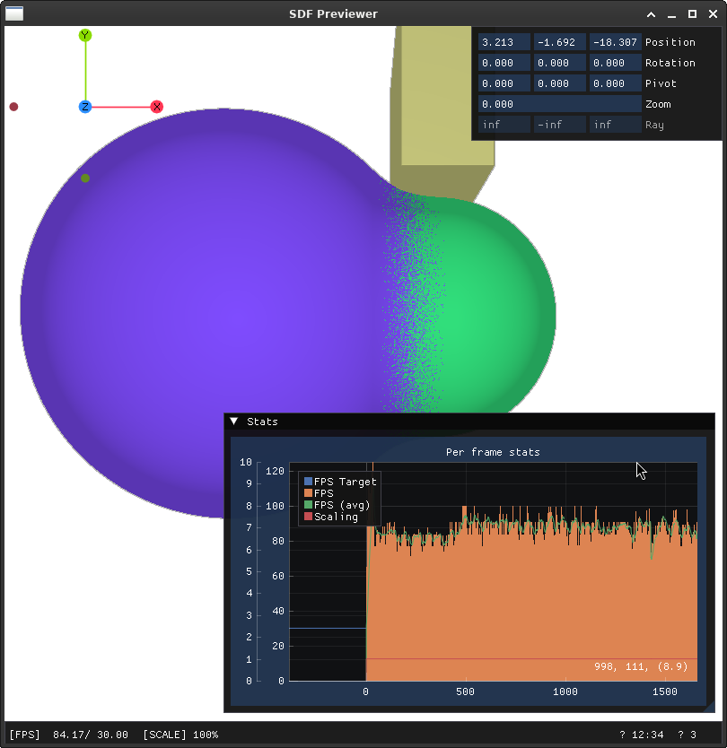

> [!WARNING]  
> This code is not ready to build or distribution. Doing so will likely result in a frustrating experience, and extra desire to smash your screen.  
> You have been warned.

## The pitch

A C++ library to make _Signed Distance Fields_[^0] easy to work with, offering an (optional) parallel implementation without vendor locking thanks to OpenMP.  
If you are not familiar with SDF and why they are great, here is just a quick primer; feel free to skip it.  

In brief, _Signed Distance Fields_ are a clever way to describe surfaces and volumes. They do that by providing for each point in space their distance (usually $L^2$) from the boundary surface.  
Unlike more traditional distances, these are signed, conventionally positive outside the volume and negative inside.  
For example, the SDF of a sphere sampled at $position$ in 3D space can be trivially described as:

```C++
float sdf_sphere(vec3 center, float radius, vec3 position){
    return dist(center-position)-radius;
}
```

Compared to meshes or voxels, SDFs have $\infty$[^1] resolution. This is similar when comparing rasterized images against vector formats like SVG[^2].  
Thanks to SDFs, several interesting operations which are hard to describe in terms of meshes, have a much simpler and elegant representation:

- Boolean operators like union and intersection of parts, including soft variants are reduced to $min$ or $max$ functions.
- Normal calculations can be exactly resolved via symbolic methods.
- Periodic repetitions
- Extrusion and revolutions
- Much more...

SDFs require GP-GPU capabilities to be reasonably flexible, which historically was not possible due to the strict limitations in shaders or even worse, the hard-coded nature of the graphical pipelines in early models.  
Still, things changed, and today we can find SDFs powering many aspects of modern game engine like light calculations, text rendering, and volumetric effects.  
And there are even [some](https://en.wikipedia.org/wiki/Tiny_Glade) [games](<https://en.wikipedia.org/wiki/Dreams_(video_game)>) where SDFs not just fancy extras but the proper backbone of the entire pipeline.

## Scope & planned features

This library is not specifically designed for real-time applications involving SDFs, nor it is meant as some sort of game/graphical engine.  
I don't mean it would be impossible to do that by using what this library offers, just that its current design is optimized to serve scientific and engineering applications.  
Applications which are more in line with the objectives of this project are:

- parametric modelling (CAD)
- slicing software for 3d printing
- physical simulations

The main objectives of this project are:

- To capture a small but meaningful selection of primitive SDFs and basic operators.
- To provide extra information like the exactness of the generated fields, boundness etc. ensuring they can be properly propagated.
- To efficiently compute (symbolic) derivatives (for normals).
- To support arbitrary SDFs defined at runtime, allowing for their dynamic evaluation without a full compiling step.
- A strong focus on parallelization via OpenMP, including offloading to GPUs and potentially other accelerators.
- The flexible definition of attribute structures for your SDFs at compile-time. You are free to experiment and implement your ideal material pipeline or spectral colouring.
- Sampling algorithms (like generating an octree from an SDF).

Things which are not in scope:

- A complete renderer, nor a full graphic pipeline. There is going to be a reference implementation, but it is only for internal testing and debugging purposes.
- A LOD system, neither automatic nor manual. Still, custom SDFs are free to do what they want within their code, and we plan to provide some wrappers to simplify this process a bit.
- Runtime support for culling of any type. This is because SDFs are intrinsically not local in character, unless explicitly restricted. Also, most strategies would depend on a specific camera model. However, we plan to offer a coarse-grainer/pruner which can work offline[^3].

### Why OpenMP?

Most of the modern computing tasks on GPU are either performed with low level APIs (like CUDA, OpenCL or HIP) or as compute shader in one of the many languages available (GLSL, HLSL and some more).  
The advantage of shaders being compiled at runtime is that they can ignore most of the vendor specific and architectural aspects of the target device, as long as there are compliant drivers available.  
However, this simplified portability is not for free:

- Compiling shaders takes time, making the application less reactive in some scenarios.
- Shader languages are not C, C++ nor rust. If one wants to target pure CPU computing as well, they will need to write code twice, or transpile it from the shader language into their native platform.
- Shader languages are very incomplete and limited compared to modern C++. They get some points thanks to their domain specific nature, but nothing operator overloads like in [glm](https://github.com/g-truc/glm) cannot do.

OpenMP allows for an implementation which has no code duplication in different languages, keeping vendor neutrality without any real compromise at runtime.

## Building

Detailed instructions for building [here](./docs/build.md).



## Prior art & dependencies

### Resources

- The excellent repository of articles from [Inigo Quilez](https://iquilezles.org/articles/) covering a lot of research on signed distance fields.
- [Several](https://rufflewind.com/2016-12-30/reverse-mode-automatic-differentiation) [articles](https://20k.github.io/c++/2024/05/18/forward-backward-differentiation.html) on automatic differentiation.
- [StyleBlit](https://dcgi.fel.cvut.cz/home/sykorad/Sykora19-EG.pdf) a nice way to texture anything based on good normals.

### Core libraries

Main libraries/specs which are enabling this project:

- [OpenMP](https://www.openmp.org/)
- [glm](https://github.com/g-truc/glm) to write most code in the style of glsl or even reuse it almost 1-to-1
- [ETL](https://www.etlcpp.com) is template library which is usually used for embedded applications. Still, it can be quite useful for offloaded kernels compared to the STL.

### Other libraries

Libraries which are not part of the library, or they are just marginally used for the demos.

- [SDL3](https://libsdl.org/)
- [imgui](https://github.com/ocornut/imgui) for the minimal UI elements in the demo.
- [fmt](https://github.com/fmtlib/fmt) to transitionally support some features from modern C++ which do not have full adoption yet.
- [stb_image](https://github.com/nothings/stb/blob/master/stb_image.h) to handle image files in the demo UI.

### Other sources

Not used directly, but broader inspiration.

- [hg_sdf](https://mercury.sexy/hg_sdf/) a library of operators for glsl.
- [libfive](https://github.com/libfive/libfive) a powerful library for solid modelling.

[^0]: 2D and 3D only, my deepest apologies to any of my higher dimensional friend.
[^1]: Sort of, floating point numbers have limited precision, but it is INFINITY in their "true" mathematical representation. Also, for infinite resolution I mean that you can have very fine fractal or noise structures without tricks like baking textures.
[^2]: It should be noticed that SDF can be quantized in a voxel structure, but unlike more typical rasterized formats, edges are well-preserved (the quantization artifact is becoming rounder not blurrier, which can be quite desirable).
[^3]: Basically, it relies upon a sampler (of which the debug renderer is a basic example) and checks if removing or replacing nodes in the SDF tree itself we get a perceptually different image. This is done adopting some heuristics and testing multiple variables in each attempt to binary search the space of "reduced" SDFs.

## Licence
All code vendored by this repo licensed under the terms of the AGPL-3.0 licence (basically everything you will find in `include` and `src`). 
Any provided example is CC-0.  
Documentation is CC BY-SA.  
Configuration files and build scripts are also AGPL-3.0.  
Contributors to this project accept to see their patches released under these terms, and give lazy-eggplant the right to re-package and re-licence them.  
Notes about the authorship will always be preserved, at the very least as part of the git history.