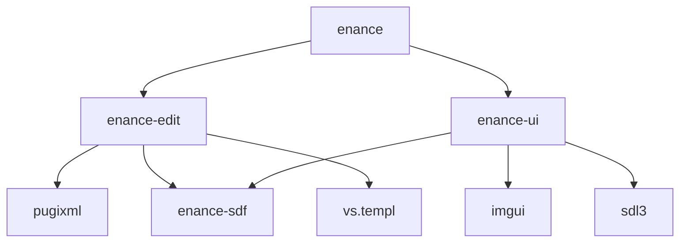

This project contains four separate packages:

- `enance-sdf`, the library of signed distance fields. `sdf/sdf.hpp`
- `enance-ui`, a basic UI library based on SDL3 and imgui, used as front end for the editor. `ui/ui.hpp`
- `enance-edit`, the actual editor. Potentially headless.
- `enance`, the visual editor based on `enance-edit` and `enance-ui`.

